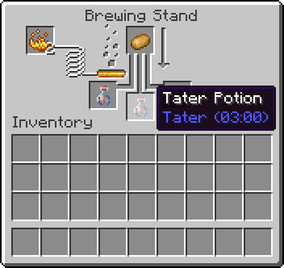

# Potions

Potions are consumables that grants an entity an effect. A player can brew potions using a Brewing Stand or obtain them
as items through various other game mechanics.

## Custom Potions

Adding a potion follows a similar path as adding an item. You will create an instance of your potion and register it by
calling `BrewingRecipeRegistry.registerPotionRecipe`.

::: info
When Fabric API is present, `BrewingRecipeRegistry.registerPotionRecipe` is made accessible through an Access Widener.

You can directly call `BrewingRecipeRegistry.registerPotionRecipe` without using a mixin.
:::

Let's assume you don't have Fabric API and instead rely on a mixin invoker to access
`BrewingRecipeRegistry.registerPotionRecipe`.

### Mixin Invoker for `BrewingRecipeRegistry.registerPotionRecipe`

In your mixin package, create the following mixin invoker. Make sure to add it to your mixin config as well.

@[code lang=java transcludeWith=:::1](@/reference/latest/src/main/java/com/example/docs/mixin/potion/BrewingRecipeRegistryInvoker.java)

### Creating the Potion

Let's start by declaring a field to store your `Potion` instance. We will be directly using the initializer class to
hold this.

@[code lang=java transclude={20-28}](@/reference/latest/src/main/java/com/example/docs/potion/FabricDocsReferencePotions.java)

We pass an instance of `StatusEffectInstance`, which takes 3 parameters:

* `StatusEffect type` - An effect. We use our custom effect here. Alternatively you can access vanilla effects
  through `net.minecraft.entity.effect.StatusEffects`.
* `int duration` - Duration of the effect in game ticks.
* `int amplifier` - An amplifier for the effect. For example, Haste II would have an amplifier of 1.

### Registering the Potion

In our initializer, we call `BrewingRecipeRegistry.registerPotionRecipe` using our mixin invoker.

@[code lang=java transclude={35-35}](@/reference/latest/src/main/java/com/example/docs/potion/FabricDocsReferencePotions.java)

`registerPotionRecipe` takes 3 parameters:

* `Potion input` - The starting potion. Usually this can be a Water Bottle or an Awkward Potion.
* `Item item` - The item which is the main ingredient of the potion.
* `Potion output` - The resultant potion.

If you use Fabric API, the mixin invoker is not necessary and a direct call
to `BrewingRecipeRegistry.registerPotionRecipe` can be done.

The full example:

@[code lang=java transcludeWith=:::1](@/reference/latest/src/main/java/com/example/docs/potion/FabricDocsReferencePotions.java)

Once registered, you can brew a Tater potion using a potato.

::: info
**Registering Potions Using an `Ingredient`**

With the help of Fabric API, it's possible to register a potion using an `Ingredient` instead of an `Item` using `
net.fabricmc.fabric.api.registry.FabricBrewingRecipeRegistry`.
:::