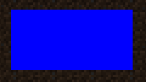
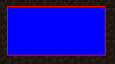
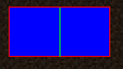
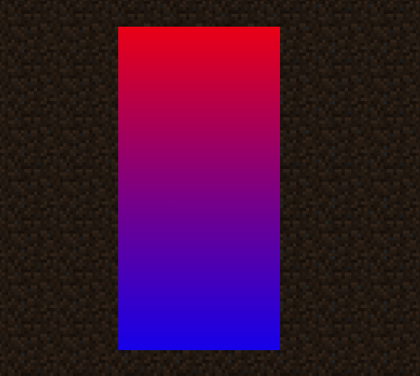

# Using The Drawing Context

This page assumes you've taken a look at the [Basic Rendering Concepts](./basic-concepts.md) page.

The `DrawContext` class is the main class used for rendering in the game. It is used for rendering shapes, text and textures, and as previously seen, used to manipulate `MatrixStack`s and use `BufferBuilder`s.

## Drawing Shapes

The `DrawContext` class can be used to easily draw **square-based** shapes. If you want to draw triangles, or any non-square based shape, you will need to use a `BufferBuilder`.

### Drawing Rectangles

You can use the `DrawContext.fill(...)` method to draw a filled rectangle.

@[code lang=java transcludeWith=:::1](@/reference/latest/src/client/java/com/example/docs/rendering/DrawContextExampleScreen.java)

### Drawing Outlines/Borders

Let's say we want to outline the rectangle we just drew. We can use the `DrawContext.drawBorder(...)` method to draw an outline.

@[code lang=java transcludeWith=:::2](@/reference/latest/src/client/java/com/example/docs/rendering/DrawContextExampleScreen.java)

### Drawing Individual Lines

We can use the `DrawContext.drawHorizontalLine(...)` and `DrawContext.drawVerticalLine(...)` methods to draw lines.

@[code lang=java transcludeWith=:::3](@/reference/latest/src/client/java/com/example/docs/rendering/DrawContextExampleScreen.java)

## The Scissor Manager

The `DrawContext` class has a built-in scissor manager. This allows you to easily clip your rendering to a specific area. This is useful for rendering things like tooltips, or other elements that should not be rendered outside of a specific area.

### Using The Scissor Manager

::: tip
Scissor regions can be nested! But make sure that you disable the scissor manager the same amount of times as you enabled it.
:::

To enable the scissor manager, simply use the `DrawContext.enableScissor(...)` method. Likewise, to disable the scissor manager, use the `DrawContext.disableScissor()` method.

@[code lang=java transcludeWith=:::4](@/reference/latest/src/client/java/com/example/docs/rendering/DrawContextExampleScreen.java)

As you can see, even though we tell the game to render the gradient across the entire screen, it only renders within the scissor region.

## Drawing Textures

[tbd]